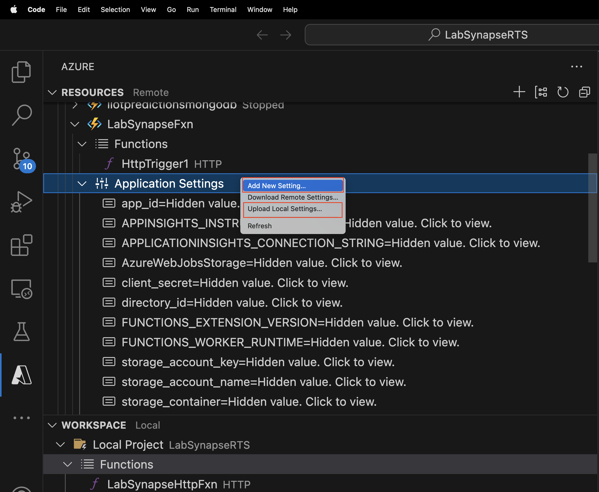

# Real Time Sync from MongoDB Atlas to Azure Synapse using Atlas Trigger and Azure Function
## Background:
Azure Synapse is used by multiple customers as a one stop solution for their analytical needs. Data is ingested from disparate sources into Synapse Dedicated SQL Pools (EDW) and SQL, AI/ ML, Batch, Spark based analytics can be performed and data is further visualized using tools like Power BI. 

MongoDB has both a [Source and Sink connector](https://learn.microsoft.com/en-us/azure/data-factory/connector-mongodb?tabs=data-factory) for Synapse pipelines which enables fetching data from MongoDB or loading data into MongoDB in batches/ micro batches.

To facilitate real time analytics, MongoDB with Microsoft provided a custom solution and gave it as a few clicks and configuration based deployment as detailed [here](https://learn.microsoft.com/en-us/azure/architecture/example-scenario/analytics/azure-synapse-analytics-integrate-mongodb-atlas).MongoDB Atlas Trigger and Azure function based solution here provides a more seamless integration for real time sync from MongoDB to Synapse.

## Solution Overview:
This simple solution uses [Atlas triggers](https://www.mongodb.com/docs/atlas/app-services/triggers/) and [functions](https://www.mongodb.com/docs/atlas/app-services/functions/) which abstracts the code needed to set up change streams and take an action based on the change detected.

### Workflow:
1. Set up a change stream on one of the collections using MongoDB Triggers.
2. MongoDB function writes the changes captured to Azure functions.
3. Azure function writes the data to synapse ADLS gen2.

In this exercise, we will use “sample_mflix.movies” namespace from the sample dataset as source for the change stream data. Thus, any changes made into this collection will add a blog in the Synapse ADLS gen2 storage.

### Prerequisites:   
- **MongoDB Atlas cluster setup:** 
  
  Register for a new Atlas account [here](https://www.mongodb.com/docs/atlas/tutorial/create-atlas-account/#register-a-new-service-account).   
  Follow steps from 1 to 4 (*Create an Atlas account*, *Deploy a free cluster*, *Add your IP to the IP access list* and *Create Database user*) to set up  the Atlas environment.   
  Also, follow step 7 “*Load Sample Data*” to load sample data to be used in the lab.


  **Note: For this lab, add “0.0.0.0/0” to the IP access list so that Synapse can connect to MongoDB Atlas. In production scenarios, It is recommended to use Private link or VNET peering instead of the IP whitelisting.**
  
- **Azure account setup:**.  
  Follow link [here](https://azure.microsoft.com/en-in/free/) to set up a free azure account
 
- **Azure Synapse Analytics workspace setup:**   
  Follow link [here](https://learn.microsoft.com/en-us/azure/synapse-analytics/get-started-create-workspace) to set up a Synapse workspace within you Azure account

### Integration Steps:   
  1. [Fetch ADLS Gen2 storage details](#fetch-adls-gen2-storage-details)  
  2. [Set Up Azure Function](#set-up-azure-function)
  3. [Set Up Atlas Trigger](#set-up-atlas-trigger)
  4. [Test Real Time Sync](#test-real-time-sync)

#### Fetch ADLS Gen2 storage details 

   Go to Azure account, search for Storage Accounts and select your default ADLS Gen2 storage associated with your Synapse workspace (“*labmdbsynapseadls*” in the example). You can always check the ADLS Gen2 account name and the default container name in your Synapse workspace, under “*Data*” tile on left and under the “*Linked*” tab.
   
   - Note down the default container under “*Containers*” under the “*Data storage*” section. (“*defaultprimary*” in the example)
   - You can create a directory under this Container or just give a name of your choice and the code will create it. (“*newcreate*” in the example)
   - Give any name for the storage_file_name (“*labsynapse*” in the example)
   - Go to the “*Access keys*” tab under “*Security + networking*” and copy one of the access keys.


Save all this information in a notepad as :

    storage_account_name = labmdbsynapseadls                                                              
    storage_account_key =  <your access key>                                                              
    storage_container = defaultprimary                                                                      
    storage_directory = newcreate                                                                             
    storage_file_name = labsynapse
  
#### Set Up Azure Function
  
  **i.** Create an HTTP triggered function app using [Visual Studio Code](https://learn.microsoft.com/en-us/azure/azure-functions/create-first-function-vs-code-python?pivots=python-mode-configuration) or [command line](https://learn.microsoft.com/en-us/azure/azure-functions/create-first-function-cli-python?tabs=azure-cli%2Cbash&pivots=python-mode-configuration).

  Replace the sample code for HTTP trigger with the below code in “function_app.py”:

  ```
import json
import logging
import os
import azure.functions as func
from azure.storage.filedatalake import DataLakeServiceClient

def main(req: func.HttpRequest) -> func.HttpResponse:
   logging.info('Python HTTP trigger function processed a new request.')
   logging.info(req)
   storage_account_name = os.environ["storage_account_name"]
   storage_account_key = os.environ["storage_account_key"]
   storage_container = os.environ["storage_container"]
   storage_directory = os.environ["storage_directory"]
   storage_file_name = os.environ["storage_file_name"]
   service_client = DataLakeServiceClient(account_url="{}://{}.dfs.core.windows.net".format(
           "https", storage_account_name), credential=storage_account_key)
   json_data = req.get_body()
   logging.info(json_data)
   object_id = "test"
   try:
       json_string = json_data.decode("utf-8")
       json_object = json.loads(json_string)

       if json_object["operationType"] == "delete":
           object_id = json_object["fullDocumentBeforeChange"]["_id"]["$oid"]
           data = {"operationType": json_object["operationType"], "data":json_object["fullDocumentBeforeChange"]}
       else:
           object_id = json_object["fullDocument"]["_id"]["$oid"]
           data = {"operationType": json_object["operationType"], "data":json_object["fullDocument"]}
       
       logging.info(object_id)
       encoded_data = json.dumps(data)
   except Exception as e:
       logging.info("Exception occured : "+ str(e)) 
       
   file_system_client = service_client.get_file_system_client(file_system=storage_container)
   directory_client = file_system_client.get_directory_client(storage_directory)
   file_client = directory_client.create_file(storage_file_name + "-" + str(object_id) + ".txt")
   file_client.append_data(data=encoded_data, offset=0, length=len(encoded_data))
   file_client.flush_data(len(encoded_data))
   return func.HttpResponse(f"This HTTP triggered function executed successfully.")
  ```   
  
      
  **ii.** Add the below to the "*requirements.txt*" file which already has *azure-functions*
      
  ```
  azure-identity                                                                                                    
  Azure-storage-file-datalake
  ```
  
  **iii.** Deploy the local project from Workspace Local to Azure. Select the upload to cloud icon and select the "*Deploy to Function App*" option. It will prompt you to select the Function App name on the top bar. Once  selected, you can see the deployment progress in the OUTPUT window of the terminal.


  **iv.** Add the storage related parameters to the Application Settings section under the Function App on Azure. Right click on “*Application Settings*” and select “*Add New Setting*”. Enter the new setting name and value when prompted. Add all the 5 storage account related values saved in Step [Fetch ADLS Gen2 Storage Details](#fetch-adls-gen2-storage-details) to the Application Settings. After adding all 5 new settings,click on “*Upload Local Settings*” to upload these settings to the Azure function app.


  
  **v.** Deploy the application again by repeating step 3. You can verify the settings by going to the Azure function and checking the “*Configuration*”  
   tab under the “*Settings*” section.
   
 

 
  **vi.** Note the Azure function url from the deployment logs. You can also get the function url by navigating to the function in Azure and selecting “*Get Function Url*”.
  


#### Set Up Atlas Trigger
  
  **i.** Select “*Triggers*” tile under “*SERVICES*” on the left of the Atlas UI. This will open the Trigger Homepage. Select the “*Add Trigger*” button on the top right to create a new trigger for our *movies* collection.

 
  

  **ii.** Let the default Trigger Type of “*Database Trigger*” remain so, give a name for the trigger (*LabSynapse* in the example). Link the “*Sandbox*” cluster under "*Link Data Source(s)*". Don't change any other settings under "*TRIGGER DETAILS*" section.

  **iii.** Under “*TRIGGER SOURCE DETAILS*”, Select the “*Cluster Name*” as “*Sandbox*”, “*Database Name*” as “*sample_mflix*” and select the “*Collection Name*” as “*movies*”. Select the Operation Type as “*Insert Document*”, “*Update Document*” and “*Delete Document*”. Also Select the “*Full Document*” and "*Document Preimage*" options.

  **iv.** Let the “*Select An Event Type*” option under “*FUNCTION*” remain selected as “_Function_”. Remove all the sample code and paste the below code in the box.

```
exports =  function(changeEvent) {

    // Invoke Azure function inserting the change stream into ADLS gen2
    console.log(typeof fullDocument);
    const response =  context.http.post({
      url: "<azure function url",
      body: changeEvent,
      encodeBodyAsJSON: true
    });
    return response;
};
```

**Note: The url needs to be replaced with your Azure function url from "Step vi" of [Set Up Azure Function](#set-up-azure-function)**

  **v.** Click “*Save*” at the bottom to Save the newly created Trigger. Once Saved, going back to Triggers Home page we can see our newly added Trigger.

Now that the Trigger is enabled, it will watch the *movies* collection for any “*Insert*”, “*Update*” or “*Delete*” operations and trigger our Azure function in the event of the insertion of a document.
  
#### Test Real Time Sync
  
  **i.** Go to Atlas “*Database*” (on left menu) and “*Browse Collections*” against your cluster (Sandbox in the example) and navigate to the “movies” collection the “*sample_mflix*” database and select “*Insert Document*” button on right side to insert a document.

  **ii.** Copy the below json into the json structure input view “{}” and click “*Insert*” button.

```
{"plot":"This  is a test plot.","genres":["Short"],"runtime":1,"cast":["test actor","test actor1"],"num_mflix_comments":0,"title":"Test Movie","fullplot":"This is a test movie and thus no full plot.","countries":["USA"],"released":{"$date":-2418768000000},"directors":["Test Directors"],"rated":"UNRATED","awards":{"wins":1,"nominations":0,"text":"1 win."},"lastupdated":"2015-08-26 00:03:50.133000000","year":1890,"imdb":{"rating":6.2,"votes":1189,"id":5},"type":"movie","tomatoes":{"viewer":{"rating":3.0,"numReviews":184,"meter":32},"lastUpdated":{"$date":1435516449000}}}
```

**iii.** Once the document is inserted , you can check in Synapse workspace, Data -> Linked -> Azure Data lake Storage Gen2. You should see a new folder created (_newcreate_ in the example) and a file with the name starting with the file name given in the storage settings in the VS Code (_labsynapse_ in the example).
Click on the document, it will download on your local machine. Verify that it is the new document we had added to the _movies_ collection.


**Congratulations ! You have successfully created the solution to capture changes in a collection using Atlas triggers and copy the changes to ADLS Gen2 within Synapse using Azure function.**


